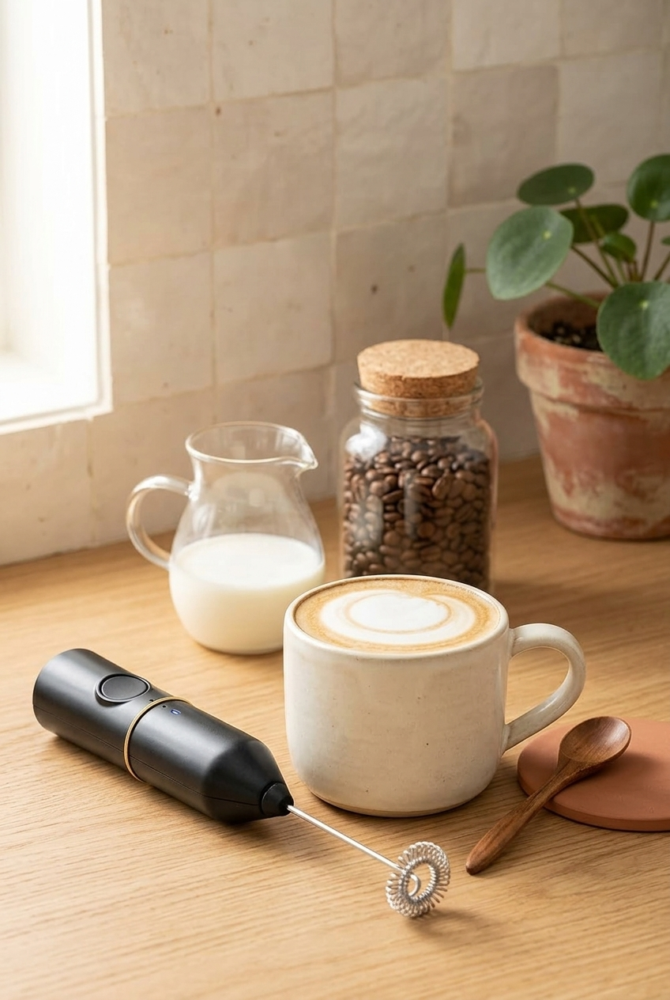
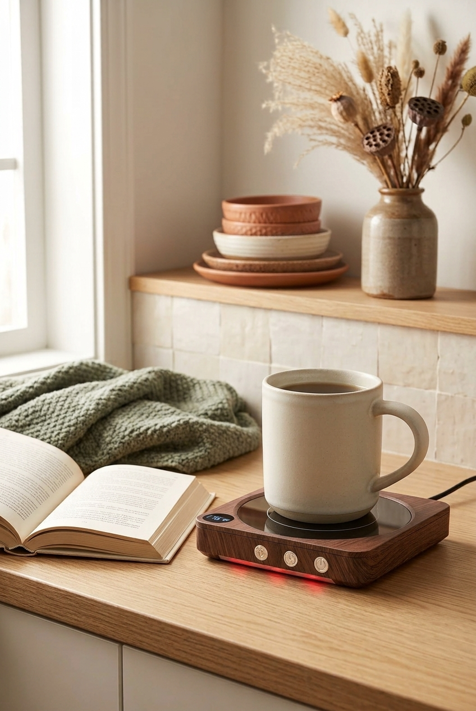
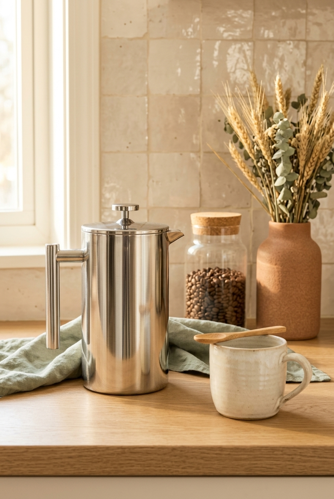

Most coffee gift guides are written for people with a kitchen island. The espresso machine, the grinder the size of a toaster, the twelve-piece canister set. For someone in a small apartment, a gift like that is a problem they now have to find room for. Everything on this list fits in a drawer, on a shelf or on the wall, and it is sorted by how the person drinks their coffee, because that decides whether a gift gets used or gets regifted.

This post contains affiliate links. If you buy through one of them I may earn a small commission, at no extra cost to you. As an Amazon Associate I earn from qualifying purchases.

## The short version

- **For the latte person:** [a handheld milk frother](https://amzn.to/46yxJbs)
- **For the one whose coffee always goes cold:** [a mug warmer](https://amzn.to/3SDQBCI)
- **For the pour over person:** [a gooseneck electric kettle](https://amzn.to/3UsXzei)
- **For the person without a machine:** [a french press](https://amzn.to/4zUbpGX)
- **For the flavoured drinks person:** [glass syrup bottles with pumps](https://amzn.to/4gCDN8Z)
- **For the one who still uses the bag with a clip:** [glass jars with bamboo lids](https://amzn.to/4zUbjiz)
- **For the one with no cabinet space:** [a wall mounted mug rail](https://amzn.to/4i9oFB7)

The reasoning for each, and who should not get it, is below.

## First, find out how they make their coffee

This one question rules out half of any coffee gift list. A pod machine, a drip machine, a french press, pour over by hand, or instant in a hurry. Each one makes some gifts useful and others pointless.

If you cannot ask directly, look at their counter next time you visit, or ask someone who lives with them. If you still do not know, go straight to the mug warmer and the jars below. Those two work with any method.

## For the latte person

### A handheld milk frother

The cheapest way to give someone cafe style foam at home. A slim battery powered whisk that lives in a drawer and turns cold milk into foam in about thirty seconds.

It is not steamed milk and it does not pretend to be. The foam is airier and collapses faster. For a weekday latte it is close enough. For latte art it is not.

Before you gift it, know that it works noticeably better with whole milk than with skim or most plant milks. If they drink oat, this will disappoint them a little.

[Check the current listing on Amazon](https://amzn.to/46yxJbs)

## For the one whose coffee always goes cold

### A mug warmer

For the person who makes a cup, answers one email, and finds it cold an hour later. A small plate under the mug holds the drink at temperature for hours, on a desk or beside a reading chair.

It works properly only with flat bottomed mugs, so a hand thrown mug with an uneven base may not make good contact. Most models also switch themselves off after a few hours, which is a safety feature rather than a flaw.

Not for someone who drinks coffee in five minutes standing up. This is entirely for slow drinkers.

[Check the current listing on Amazon](https://amzn.to/3SDQBCI)

## For the pour over person

### A gooseneck electric kettle

The long, thin spout gives control over where and how fast the water lands, which a regular kettle cannot. For someone who already makes pour over by hand, it is a real upgrade and the kind of thing people want but do not buy for themselves.

For anyone who uses a pod or drip machine, it is a kettle with a funny spout. Skip it. It is also the most expensive gift on this list, so it is the one to be sure about.

[Check the current listing on Amazon](https://amzn.to/3UsXzei)

## For the person without a machine

### A french press

No power, no paper filters and almost no counter space. For a first apartment, a dorm, or someone who has not decided which machine to buy, it makes good coffee without committing to anything.

The trade-off is time and cleanup. Four minutes of steeping, then a plunger full of wet grounds. People with rushed mornings find it annoying within a week, so this suits the weekend coffee person better than the out-the-door one.

[Check the current listing on Amazon](https://amzn.to/4zUbpGX)

## For the flavoured drinks person

### Glass syrup bottles with pumps

For someone who buys vanilla or caramel syrup and pours it straight from a sticky plastic bottle. Pump bottles make the corner look like a coffee bar and make a flavoured latte a one-handed job.

If they drink their coffee black, this is decoration that takes shelf space. Pumps also drip, so pair the bottles with a small tray if you want the gift to feel complete.

[Check the current listing on Amazon](https://amzn.to/4gCDN8Z)

## For the one who still uses the bag with a clip

### Glass jars with bamboo lids

An opened coffee bag with a clip is bad at keeping beans fresh and ugly on a counter. Two sealed jars fix both problems, one for beans and one for sugar.

A practical tip: fill one jar with a bag of beans from a local roaster before you wrap it. The jar is useful, the coffee is personal, and together they feel like more than either one alone.

Glass is heavy and shows fingerprints. If the jars are going on a light adhesive shelf, that matters.

[Check the current listing on Amazon](https://amzn.to/4zUbjiz)

## For the one with no cabinet space

### A wall mounted mug rail

Hanging four mugs frees a whole cabinet shelf, which in a small kitchen is a bigger gift than it sounds. It also puts their favourite mugs on display instead of behind a door.

Check two things first: whether they can put screws in the wall, and whether their wall suits an adhesive version. Renters with textured or matte painted walls are the people for whom this goes wrong.

[Check the current listing on Amazon](https://amzn.to/4i9oFB7)

## What I would skip

**Novelty mugs with slogans.** One laugh, then a decade at the back of the cupboard. They already own too many mugs.

**Espresso machines at the cheap end.** They make disappointing coffee loudly, and the person will feel obliged to keep it on a counter they do not have.

**Big matching gift sets.** Six canisters, four scoops, a stand for all of it. In a small kitchen that is a storage problem wrapped in paper.

**Anything that needs counter space you have not seen.** If you do not know their kitchen, choose something that goes in a drawer or on a wall.

## FAQ

**What is a good gift for a coffee lover with a small kitchen?**

Something that lives in a drawer, on a shelf or on the wall. A milk frother, a mug warmer, glass jars or a mug rail all qualify. Avoid anything that needs its own patch of counter unless you know it fits.

**What if I do not know what coffee maker they have?**

Choose a gift that works with any method: a mug warmer, glass jars for beans, or a mug rail. Avoid pod accessories and pour over gear, which only make sense for one kind of setup.

**Is a mug warmer a good gift?**

For slow drinkers, yes, and they rarely buy one for themselves. Check that their mugs have flat bottoms, since uneven bases do not heat well.

**When should I buy coffee gifts for the holidays?**

Earlier than feels necessary. Popular kitchen items go in and out of stock before December, and shipping gets slower as the holidays get closer. Buying in October or November also leaves time to swap something that turns out to be the wrong fit.

## If you only buy one

Get the mug warmer. It works with every kind of coffee and every size of kitchen, it takes up less space than a mug, and it solves a problem almost everyone has and almost nobody fixes for themselves. The frother is a better gift for a latte person and the kettle is better for a pour over person, but if you are not sure who you are buying for, the warmer is the safe choice.
