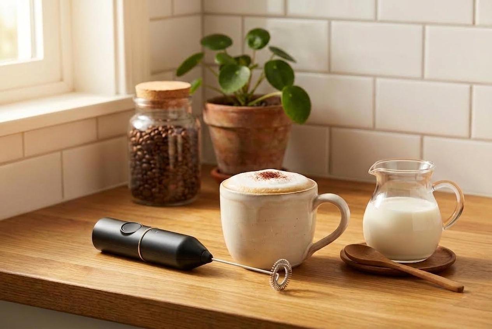
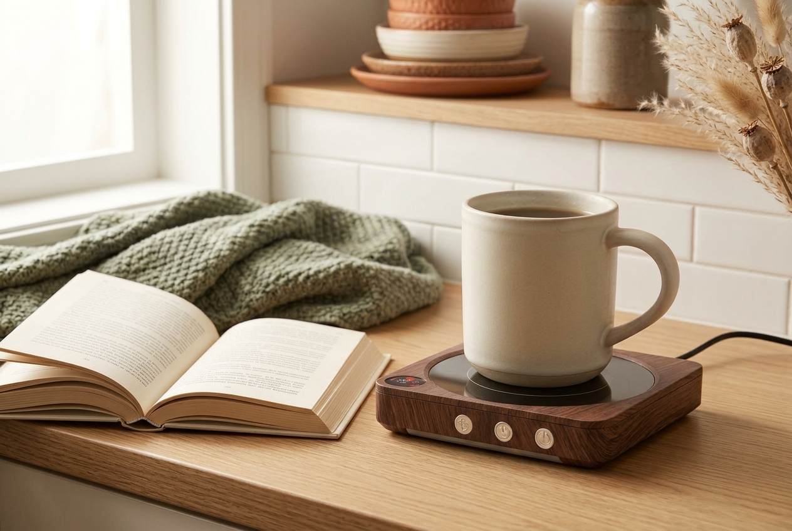
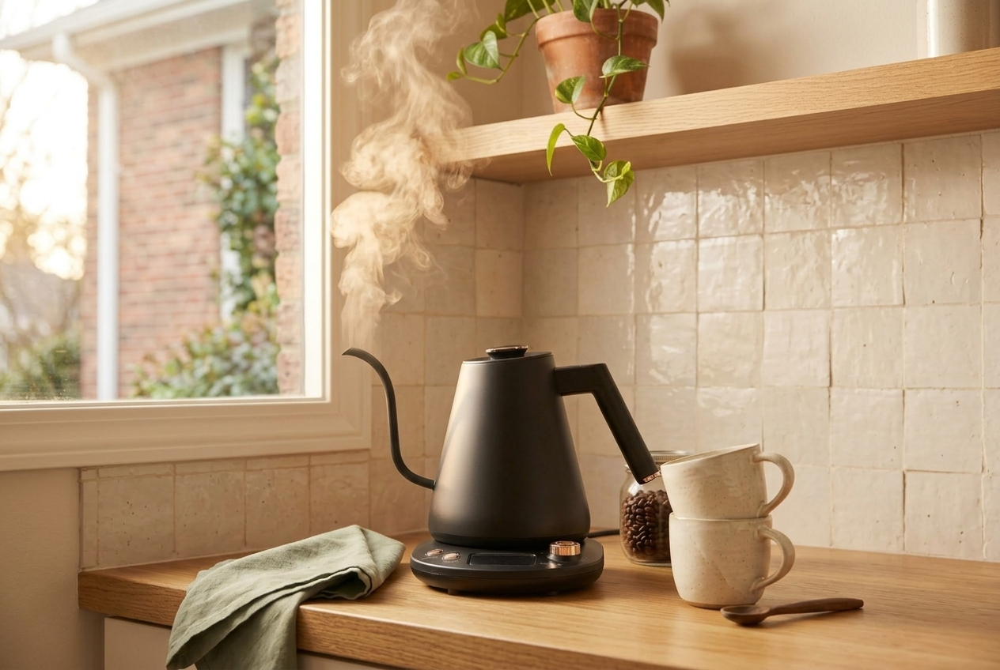

Prime Big Deal Days runs on October 6 and 7, and some early deals are already live. Nobody outside Amazon knows the full list in advance, including me. So this is not a list of discounts. It is a list of things worth having in a small kitchen at full price, which is what makes them worth checking when prices move.

This post contains affiliate links. If you buy through one of them I may earn a small commission, at no extra cost to you. As an Amazon Associate I earn from qualifying purchases.

## How to use this list

The sale is Prime member only, and new deals appear through both days. Prices change several times a day, and putting something in your cart does not lock the price.

One rule makes the whole event simpler: if something here is discounted, good. If it is not, ask whether you would want it at the normal price. If the answer is no, the discount was the only reason to want it, and that is the worst reason to add an object to a small kitchen.

## Small buys

### A handheld milk frother

The cheapest way to get foam without an espresso machine. It lives in a drawer and takes about thirty seconds. It is not steamed milk, the foam is airier and collapses faster, but for a weekday latte it is close enough.

Worth knowing before you buy: it works noticeably better with whole milk than with skim or most plant milks.

[Check the current listing on Amazon](https://amzn.to/46yxJbs)

### Glass syrup bottles with pumps

The piece that turns a counter with a machine on it into something that reads as a coffee bar. Genuinely useful if you make flavoured drinks, pure decoration if you drink your coffee black.

Pumps drip. Whatever they sit on will need wiping, which is an argument for keeping them on a small tray.

[Check the current listing on Amazon](https://amzn.to/4gCDN8Z)

### Glass jars with bamboo lids

A coffee bag with a clip is the ugliest thing on most counters and bad at its job once opened. Two jars fix both problems, one for beans and one for sugar.

The trade-off is weight. Glass is heavy, which matters if the jars are going on an adhesive shelf rather than a counter.

[Check the current listing on Amazon](https://amzn.to/4zUbjiz)

### A wall mounted mug rail

Hanging four mugs frees a whole cabinet shelf, which is the best trade available in a small kitchen. Measure the spot before ordering, and check whether your wall takes screws or needs an adhesive version.

[Check the current listing on Amazon](https://amzn.to/4i9oFB7)

## Mid range

### A mug warmer

For the person who reheats the same cup three times before finishing it. A small plate under the mug holds the drink at temperature for hours.

Two things to check first. It only works properly with flat bottomed mugs, so a favourite hand thrown one with an uneven base may not make good contact. And most have an auto shut off between two and twelve hours, which is a safety feature rather than a limitation.

[Check the current listing on Amazon](https://amzn.to/3SDQBCI)

### A french press

No power, no paper filters, almost no counter space. It also looks right sitting on an open shelf in a way a plastic machine does not.

The cost is time and cleanup: four minutes of steeping, then a plunger full of wet grounds. If your mornings are rushed this will irritate you inside a week.

[Check the current listing on Amazon](https://amzn.to/4zUbpGX)

### Narrow floating shelves

The foundation of a coffee bar that does not take over the counter. Four to six inches deep holds mugs and jars without eating counter depth. Anything deeper starts collecting things at the back where you cannot see them.

Check the weight rating against what you actually plan to put up there, and test an adhesive mount with one light object for a week before loading it.

[Check the current listing on Amazon](https://amzn.to/4gOrJAm)

### A three tier bamboo organizer

Two extra levels of storage on the same counter footprint, with nothing attached to a wall. It comes with you when you move, which matters in a rental.

Measure the height under your wall cabinets first. A stand that does not fit underneath is a return.

[Check the current listing on Amazon](https://amzn.to/4xyiBH8)

## Worth waiting for a sale

### A gooseneck electric kettle

The most expensive item here and the one where a discount changes the decision. The long spout gives you pouring control a normal kettle cannot, which only matters if you make pour over coffee by hand.

If you use a pod machine, a drip machine, or a french press, skip this entirely. It improves your coffee less than better beans do.

[Check the current listing on Amazon](https://amzn.to/3UsXzei)

## What I would skip, even on sale

**Espresso machines under a hundred dollars.** A steep discount on a machine that makes disappointing coffee is still a machine that makes disappointing coffee, and it occupies counter space every single day.

**Large matching organizer sets.** You will fill every piece. Half of them will end up holding things you use twice a year.

**Anything sized for a kitchen you do not have.** The best price on the wrong dimensions is not a deal. Measure first, then shop.

## If you only check one thing

Check the milk frother. It is the smallest purchase on this list, it stores in a drawer, and for the money it changes an ordinary cup of coffee more than anything else here.
